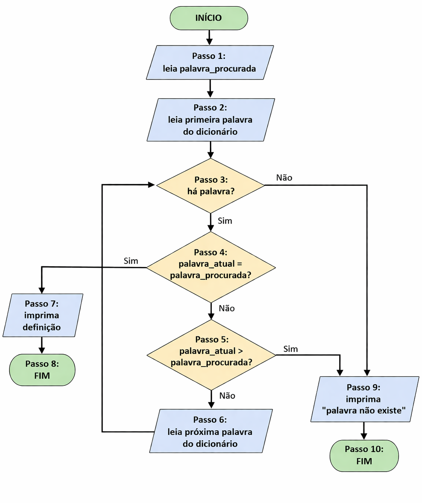
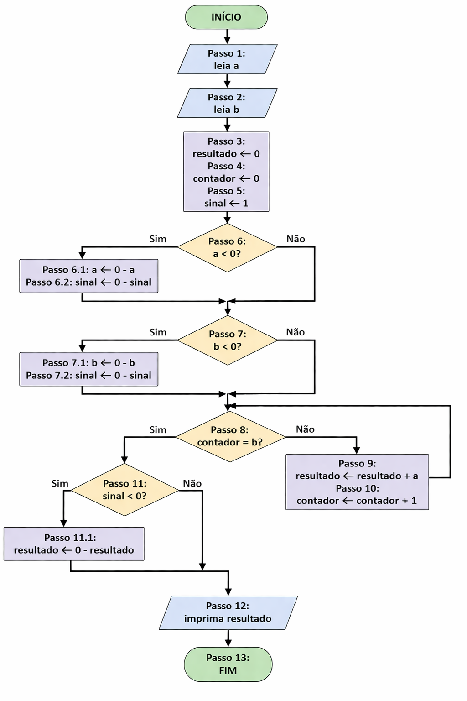
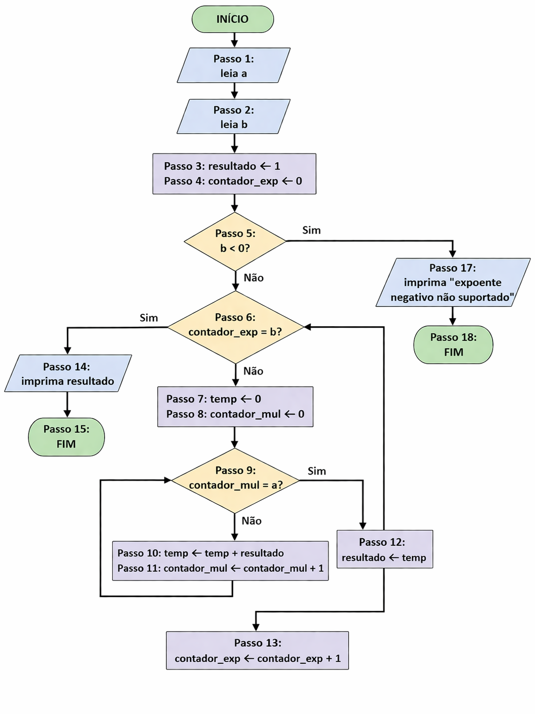
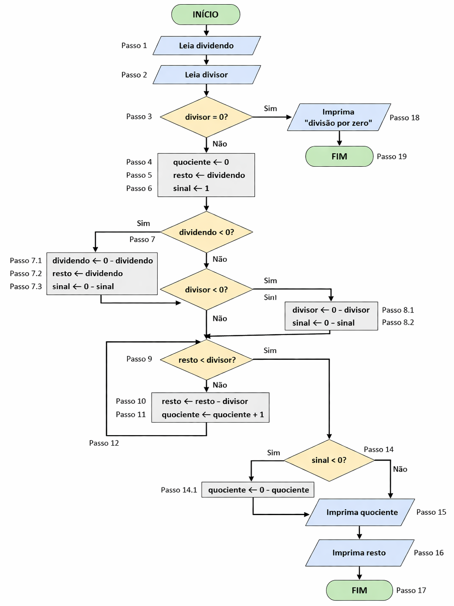

+++
title = 'Cap2'
date = 2026-04-05T12:15:05-03:00
draft = true
+++

# 📘 Exercícios — Capítulo 2

# Bases da Programação
## 2.2 Algoritmos
### Exercício 2.1
Escreva um algoritmo para fritar um ovo. Se não souber, escreva mesmo assim e depois pergunte a alguém que saiba. Houve
muita diferença? Você esqueceu algum detalhe?


**Ideia:**  
Descrever passo a passo o processo de fritar um ovo, evidenciando a necessidade de precisão em algoritmos do mundo real.

**Pseudocódigo:**
```text
INÍCIO
  1. PEGUE uma frigideira
  2. COLOQUE a frigideira no fogão
  3. LIGUE o fogão
  4. AJUSTE o fogo para médio
  5. ADICIONE óleo ou manteiga na frigideira
  6. AGUARDE até aquecer
  7. PEGUE um ovo
  8. QUEBRE o ovo
  9. DESPEJE o conteúdo na frigideira
  10. AGUARDE até a clara ficar branca e firme
  11. AGUARDE mais tempo até a gema atingir o ponto desejado
  12. RETIRE o ovo da frigideira
  13. DESLIGUE o fogão
  14. COLOQUE o ovo em um prato
FIM



---
### Exercício 2.2
Imagine que você vai ensinar a uma criança de 6 anos, já alfabetizada, a procurar uma palavra no dicionário. Escreva um passo a
passo de suas instruções.


### Exercício — Procurar uma palavra no dicionário

**Ideia:**  
Descrever um procedimento simples e preciso para localizar uma palavra usando a ordem alfabética.

Como é uma criança de 6 anmos, temos que fazer certas suposições:

 1. Ela não tem o conceito de ordem alfabética
 2. Ela não sabe o conceito de uma palavra "maior"que a outra.

**Pseudocódigo:**
```text
INÍCIO
1. LEIA palavra a ser procurada
2. ABRA o dicionário na primeira página
3. IDENTIFIQUE a primeira letra da palavra
4. ENQUANTO não encontrar uma palavra que comece 
   com a mesma letra 
4.1    VIRE a página
5. LEIA uma palavra da página
6. SE a palavra atual for igual à palavra procurada ENTÃO
6.2      FALE "Palavra encontrada!"
6.3      PARE
7. SE não tem mais palavras para ler
7.1    FALE "Palavra não encontrada"
7.2    PARE
8. LEIA a próxima palavra
9. SE a primeira letra for maior que a 
   primeira letra da palavra procurada ENTÃO
9.1    FALE "Palavra não encontrada"
9.2    PARE
10. VOLTE para o PASSO 6
FIM

Para uma criança, é comum faltar a noção de “ordem alfabética” 
e de comparação entre palavras. Um passo adicional poderia explicar 
como comparar letra por letra. Além disso, na 
prática, usamos pistas como as palavras-guia no topo das páginas, 
o que não foi explicitado no algoritmo inicial.

Perceba a difuldade de escrever um algoritmo suficientemenet 
completa para uma tarefa tão simples se quem vai executá-lo 
tem poucas habilidades.


---

## 2.3 Um Algoritmo Computacional Simples
### Exercício 2.3
Como seria o algoritmo desta seção se levarmos em conta que um dicionário é organizado alfabeticamente? Escreva uma nova
versão considerando esta característica.


### Exercício — Busca em dicionário considerando ordem alfabética (versão sequencial numerada)

**Ideia:**  
Percorrer as palavras em ordem e interromper assim que encontrar a palavra ou ultrapassar sua posição alfabética.

**Pseudocódigo:**
```text
Passo 1: leia palavra_procurada
Passo 2: leia primeira palavra do dicionário
Passo 3: se não houver palavra então vá para o passo 9
Passo 4: se palavra_atual = palavra_procurada então vá para o passo 7
Passo 5: se palavra_atual > palavra_procurada então vá para o passo 9
Passo 6: leia próxima palavra do dicionário e volte ao passo 3
Passo 7: imprima definição
Passo 8: termine a execução do algoritmo
Passo 9: imprima "palavra não existe"
Passo 10: termine a execução do algoritmo


---
### Exercício 2.4
Imagine uma máquina que possua somente as operações aritméticas de soma e subtração. Escreva um algoritmo para fazer
uma multiplicação.


### Exercício — Multiplicação usando apenas soma e subtração (corrigido)

**Ideia:**  
Transformar a multiplicação em soma repetida, tratando o sinal antes do processo principal.

**Pseudocódigo:**
```text
Passo 1: leia a
Passo 2: leia b
Passo 3: resultado <- 0
Passo 4: contador <- 0
Passo 5: sinal <- 1

Passo 6: se a < 0 então faça:
Passo 6.1: a <- 0 - a
Passo 6.2: sinal <- 0 - sinal

Passo 7: se b < 0 então faça:
Passo 7.1: b <- 0 - b
Passo 7.2: sinal <- 0 - sinal

Passo 8: se contador = b então vá para o passo 11
Passo 9: resultado <- resultado + a
Passo 10: contador <- contador + 1 e volte ao passo 8

Passo 11: se sinal < 0 então faça:
Passo 11.1: resultado <- 0 - resultado

Passo 12: imprima resultado
Passo 13: termine a execução do algoritmo


---

### Exercício 2.5
Com a mesma máquina do exercício anterior, escreva um algoritmo para a exponenciação.


### Exercício — Exponenciação usando apenas soma e subtração

**Ideia:**  
Calcular \(a^b\) como multiplicações sucessivas, e cada multiplicação é feita por soma repetida.

**Pseudocódigo:**
```text
Passo 1: leia a
Passo 2: leia b

Passo 3: resultado <- 1
Passo 4: contador_exp <- 0

Passo 5: se b < 0 então vá para o passo 17

Passo 6: se contador_exp = b então vá para o passo 14

Passo 7: temp <- 0
Passo 8: contador_mul <- 0

Passo 9: se contador_mul = a então vá para o passo 12
Passo 10: temp <- temp + resultado
Passo 11: contador_mul <- contador_mul + 1 e volte ao passo 9

Passo 12: resultado <- temp
Passo 13: contador_exp <- contador_exp + 1 e volte ao passo 6

Passo 14: imprima resultado
Passo 15: termine a execução do algoritmo

Passo 17: imprima "expoente negativo não suportado"
Passo 18: termine a execução do algoritmo


Melhore esta versão para trabalhar também com números negativos.


---
### Exercício 2.6
Ainda com a mesma máquina, escreva um algoritmo para a divisão.


### Exercício — Divisão usando apenas soma e subtração

**Ideia:**  
Realizar a divisão como subtrações sucessivas do divisor até que o valor restante seja menor que ele. O número de subtrações corresponde ao quociente.

**Pseudocódigo:**
```text
Passo 1: leia dividendo
Passo 2: leia divisor

Passo 3: se divisor = 0 então vá para o passo 18

Passo 4: quociente <- 0
Passo 5: resto <- dividendo
Passo 6: sinal <- 1

Passo 7: se dividendo < 0 então faça:
Passo 7.1: dividendo <- 0 - dividendo
Passo 7.2: resto <- dividendo
Passo 7.3: sinal <- 0 - sinal

Passo 8: se divisor < 0 então faça:
Passo 8.1: divisor <- 0 - divisor
Passo 8.2: sinal <- 0 - sinal

Passo 9: se resto < divisor então vá para o passo 14

Passo 10: resto <- resto - divisor
Passo 11: quociente <- quociente + 1
Passo 12: vá para o passo 9

Passo 14: se sinal < 0 então faça:
Passo 14.1: quociente <- 0 - quociente

Passo 15: imprima quociente
Passo 16: imprima resto
Passo 17: termine a execução do algoritmo

Passo 18: imprima "divisão por zero"
Passo 19: termine a execução do algoritmo


---
## 2.4 Fluxogramas
### Exercício 2.7
Desenhe fluxogramas para os algoritmos que você desenvolveu na Seção 2.3.

#### Fluxograma para algoritmo de busca em dicionário





#### Fluxograma para algoritmo de multiplicação




#### Fluxograma para algoritmo de exponenciação




#### Fluxograma para algoritmo de divisão





---
## 2.6 Identificadores
### Exercício 2.8
Reescreva de forma correta os seguintes identificadores:
1. duas+palavras
2. 123var
3. campo minado
4. var?
5. Número


1. duas_palavras
2. var_123
3. campo_minado
4. var
5. numero


---
## 2.7 Dados
### Exercício 2.9
Faça um programa em Python que calcule a área de um quadrado.


### Exercício — Área de um quadrado em Python

**Ideia:**  
A área de um quadrado é dada pelo lado multiplicado por ele mesmo.

**Programa:**
```python
# lê o valor do lado
lado = float(input("Digite o valor do lado do quadrado: "))

# calcula a área
area = lado * lado

# imprime o resultado
print("Área do quadrado:", area)


---
### Exercício 2.10
Faça um programa em Python que calcule o número de segundos após a meia-noite. Crie identificadores para hora, minuto e
segundo.


### Exercício — Segundos após a meia-noite em Python

**Ideia:**  
Converter horas e minutos para segundos e somar com os segundos informados.

- 1 hora = 3600 segundos  
- 1 minuto = 60 segundos  

**Programa:**
```python
# lê os valores
hora = int(input("Digite a hora: "))
minuto = int(input("Digite o minuto: "))
segundo = int(input("Digite o segundo: "))

# calcula o total de segundos após a meia-noite
total_segundos = hora * 3600 + minuto * 60 + segundo

# imprime o resultado
print("Segundos após a meia-noite:", total_segundos)


---
### Exercício 2.11
O Universo surgiu há cerca de 14 bilhões de anos. Escreva um programa Python que calcule quantos segundos se passaram
desde esse momento.


### Exercício — Segundos desde o surgimento do Universo

**Ideia:**  
Converter anos em segundos, usando aproximações padrão:
- 1 ano ≈ 365 dias  
- 1 dia = 24 × 3600 segundos  

Este cálculo usa uma aproximação simples (ignora anos bissextos). Para maior precisão, poderíamos usar 365,25 dias por ano. Além disso, o valor de 14 bilhões de anos é uma estimativa científica, não exata.

**Programa:**
```python
# idade do universo em anos
anos = 14_000_000_000

# conversões
dias_por_ano = 365
segundos_por_dia = 24 * 3600

# cálculo
total_segundos = anos * dias_por_ano * segundos_por_dia

# saída
print("Segundos desde o surgimento do Universo:", total_segundos)


---
### Exercício 2.12
Um número realmente grande é um googol. Em 1938, o matemático Edward Kasner pediu ao seu sobrinho de 8 anos que
inventasse um nome para um número muito grande. Assim nasceu o googol. Como você deve estar desconfiando, esse número
deu origem ao nome de uma grande empresa da Internet. Um googol corresponde a 10<sup>100</sup>. Escreva um programa em Python
que imprima um googol. Lembre-se de que a exponenciação em Python é representada por **.


### Exercício — Imprimindo um googol em Python

**Ideia:**  
Um googol é \(10<sup>100</sup>\). Em Python, usamos o operador "**" para exponenciação.

**Programa:**
```python
# calcula um googol
googol = 10 ** 100

# imprime o resultado
print(googol)


---
### Exercício 2.13
Um googolplexo é dez elevado a um googol (10<sup>googol</sup>). Escreva um programa que imprima um googolplexo. Não execute!
Este programa trava. Por quê?


### Exercício — GoogoIplexo em Python

**Ideia:**  
Um googolplexo é (10<sup>googol</sup>), ou seja, 10<sup>10<sup>100</sup></sup>. O programa pode ser escrito, mas não deve ser executado.

Este programa trava porque o número de dígitos do resultado é gigantesco: um googolplexo tem 10<sup>10<sup>100</sup></sup> +1 dígitos. 
Para armazenar esse número, o computador precisaria de uma quantidade absurda de memória (muito além de qualquer máquina real). Além disso, o tempo de processamento para calcular e imprimir esse valor é impraticável. Mesmo com inteiros de precisão arbitrária, existem limites físicos e  nem se você escrevesse um dígito em cada átomo do universo, você chegaria perto de escrever um googolplexo.

**Programa:**
```python
# calcula um googol
googol = 10 ** 100

# calcula um googolplexo
googolplexo = 10 ** googol

# imprime o resultado
print(googolplexo)


---
### Exercício 2.14
Vamos supor que podemos dobrar uma folha de papel quantas vezes quisermos. Essa folha tem espessura de 0,1 mm. Depois de
a dobrarmos 107 vezes, qual seria sua altura? Lembre-se de que a cada dobradura, a espessura dobra. Crie um programa que
execute e imprima este cálculo.


### Exercício — Dobras de uma folha de papel

**Ideia:**  
A cada dobra, a espessura dobra. Isso caracteriza crescimento exponencial:
\[
\text{espessura} = 0{,}1 \times 2^{n}
\]

**Programa:**
```python
# espessura inicial em milímetros
espessura = 0.1

# número de dobras
n = 107

# cálculo
altura = espessura * (2 ** n)

# saída
print("Altura após", n, "dobras:", altura, "mm")


---
### Exercício 2.15
Faça um programa que dê o resultado do exercício anterior em metros, quilômetros e anos-luz.


### Exercício — Dobras de uma folha de papel (múltiplas unidades)

**Ideia:**  
Calcular a espessura após \(n\) dobras e converter o resultado para diferentes unidades: metros, quilômetros e anos-luz.

**Programa:**
```python
# espessura inicial em milímetros
espessura = 0.1

# número de dobras
n = 107

# cálculo da altura em mm
altura_mm = espessura * (2 ** n)

# conversões
altura_m = altura_mm / 1000
altura_km = altura_m / 1000
metros_por_ano_luz = 9.46e15
altura_anos_luz = altura_m / metros_por_ano_luz

# saída
print("Altura após", n, "dobras:")
print(altura_m, "metros")
print(altura_km, "quilômetros")
print(altura_anos_luz, "anos-luz")



---

## 2.9 Constantes

### Exercício 2.16

Procure valores mais precisos para &pi; (pi) e <i>e</i> (número de Euler). Substitua no Programa 2.12 e execute, anotando o resultado. Você consegue colocar dígitos suficientes para que o erro desapareça e Python dê como resultado zero?



### Exercício — Precisão na identidade de Euler

**Ideia:**  
Testar a identidade de Euler (e<sup>&pi;i</sup> + 1 = 0) usando valores cada vez mais precisos de (e) e (&pi;), observando os efeitos de erro numérico.

**Programa:**
```python
# valores mais precisos
PI = 3.141592653589793
E = 2.718281828459045
I = 1j

print("0 =", E ** (PI * I) + 1)
```

Mesmo usando muitos dígitos de 𝑒 e 𝜋, o resultado nunca será exatamente zero em Python. Isso ocorre porque números reais são representados em ponto flutuante (IEEE 754), que possui precisão finita. Pequenos erros de arredondamento são inevitáveis e se propagam nas operações.

Uma forma melhor de obter o resultado próximo de zero é usar a biblioteca math ou cmath, que já fornecem constantes com alta precisão e funções otimizadas:

```python
import cmath

print("0 =", cmath.exp(1j * cmath.pi) + 1)
```


Ainda assim, o resultado será algo como:

(0+1.2246467991473532e-16j)



---
### Exercício 2.17
Escreva um programa que calcule o quadrado da hipotenusa de um triângulo de lados 3 e 4, usando o teorema de Pitágoras.


### Exercício — Quadrado da hipotenusa (Teorema de Pitágoras)

**Ideia:**  
Pelo teorema de Pitágoras, o quadrado da hipotenusa é a soma dos quadrados dos catetos: c<sup>2</sup> = a<sup>2</sup> + b<sup>2</sup>.

**Programa:**
```python
# valores dos catetos
lado_a = 3
lado_b = 4

# cálculo do quadrado da hipotenusa
hipotenusa2 = lado_a**2 + lado_b**2

# saída
print("Quadrado da hipotenusa:", hipotenusa2)
```
O programa calcula diretamente 
𝑐 hipotenusa<sup>2</sup>, sem extrair a raiz quadrada. Para os valores dados, o resultado é 25, o que implica que a hipotenusa é 5.



---
### Exercício 2.18
Escreva um programa que calcule a área de uma esfera de raio 5.


### Exercício — Área de uma esfera

**Ideia:**  
A área da superfície de uma esfera é dada por:

A = 4πr²

**Programa:**
```python
PI = 3.1415

# raio da esfera
r = 5

# cálculo da área
area = 4 * PI * r**2

# saída
print("Área da esfera:", area)
```

Utilizar math.pi forneceria uma maior precisão do que definir manualmente o valor de π.



---
### Exercício 2.19
O algoritmo da busca binária apresentado nesta seção pode ser ainda mais refinado. Como fazer para acrescentar detalhes a
esse algoritmo?


### Exercício — Refinando o algoritmo de busca binária

**Ideia:**  
Acrescentar detalhes significa eliminar ambiguidades e tornar cada passo executável sem interpretação humana. No caso da busca binária, isso envolve explicitar limites, cálculo do meio e condições de parada.

**Pseudocódigo:**
```text
Passo 1: leia palavra_procurada
Passo 2: inicio <- primeira página do dicionário
Passo 3: fim <- última página do dicionário

Passo 4: se inicio > fim então vá para o passo 12

Passo 5: meio <- (inicio + fim) // 2
Passo 6: abra o dicionário na página meio
Passo 7: leia palavra_atual

Passo 8: se palavra_atual = palavra_procurada então vá para o passo 10

Passo 9: se palavra_procurada < palavra_atual então faça:
Passo 9.1: fim <- meio - 1
Passo 9.2: volte ao passo 4

Passo 10: se palavra_procurada > palavra_atual então faça:
Passo 10.1: inicio <- meio + 1
Passo 10.2: volte ao passo 4

Passo 11: imprima definição
Passo 12: imprima "palavra não existe"
Passo 13: termine a execução do algoritmo
```

O refinamento substitui descrições vagas como “abrir no meio” por operações precisas (cálculo do índice médio) e explicita o estado do problema (inicio, fim). Esse processo é essencial em algoritmos: transformar uma ideia intuitiva em uma sequência rigorosa e não ambígua de passos.


---